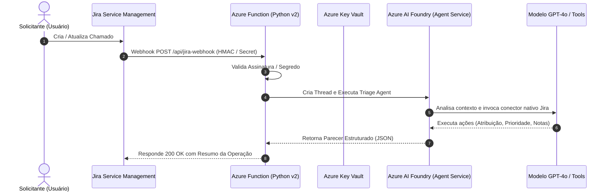

# OSB Jira Agent 🤖🎫

Agente de Inteligência Artificial hospedado na plataforma **Microsoft Azure AI Foundry** (Azure AI Agent Service), integrado nativamente ao **Jira Service Management (JSM)** para automação operacional de chamados: triagem inteligente, classificação de prioridade, roteamento para equipes e transições automáticas de status.

---

## 📌 Arquitetura da Solução

O fluxo operacional é orientado a eventos (*event-driven*), garantindo tempo de resposta quase em tempo real e eficiência de custos com computação serverless:



### Principais Pilares

1. **Microsoft Azure AI Foundry**: Orquestra o agente autônomo com o modelo GPT-4o, prompts especializados em ITSM e o conector nativo do Jira.
2. **Azure Functions (Python v2 Model)**: Webhook receiver serverless leve, resiliente e seguro.
3. **Segurança Enterprise**:
   - Autenticação com serviços Azure via **Managed Identity** (`DefaultAzureCredential`).
   - Validação de webhooks com verificação em tempo constante (`hmac.compare_digest`) contra segredos protegidos.
4. **Infraestrutura como Código (Terraform)**: Módulos reutilizáveis para Azure AI Foundry, Key Vault e Function App.
5. **Tooling Moderno**: Gerenciamento ultrarrápido com `uv` e testes automatizados com `pytest`.

---

## 📁 Estrutura do Repositório

```text
osb-jira-agent/
├── .github/
│   └── workflows/
│       └── ci.yml                 # Pipeline CI (Lint, Test, Terraform check)
├── terraform/                     # Infraestrutura como Código modular
│   ├── main.tf                    # Orquestração principal dos módulos
│   ├── variables.tf               # Variáveis de entrada
│   ├── outputs.tf                 # Endpoints e IDs provisionados
│   ├── terraform.tfvars.example   # Modelo de variáveis locais
│   └── modules/
│       ├── ai_foundry/            # AI Services, Hub & Model Deployment
│       ├── key_vault/             # Key Vault e gestão de segredos
│       └── function_app/          # Storage, Function App e RBAC
├── src/
│   ├── agent/
│   │   ├── foundry_client.py      # Conexão com Foundry via DefaultAzureCredential
│   │   ├── prompts.py             # Prompts de ITSM e regras de negócio
│   │   └── triage_agent.py        # Orquestrador da thread e execução do agente
│   ├── models/
│   │   ├── agent_result.py        # Modelos Pydantic de saída da decisão
│   │   └── jira_webhook.py        # Modelos Pydantic de payload do Jira
│   ├── security/
│   │   └── webhook_verifier.py    # Validação de token e HMAC do webhook
│   ├── utils/
│   │   └── logger.py              # Logging formatado
│   ├── config.py                  # Pydantic Settings e variáveis de ambiente
│   └── function_app.py            # Definição dos endpoints HTTP da Function
├── tests/
│   ├── conftest.py                # Fixtures e payloads de exemplo
│   ├── test_function_app.py       # Testes dos endpoints HTTP da Function
│   ├── test_triage_agent.py       # Testes de triagem e parsing de decisão
│   └── test_webhook_security.py   # Testes de validação de segurança
├── function_app.py                # Ponto de entrada raiz do Azure Functions host
├── host.json                      # Configuração do runtime do Azure Functions
├── local.settings.json.example    # Variáveis para emulação local do Azure Functions
├── pyproject.toml                 # Dependências gerenciadas via uv
├── Makefile                       # Comandos rápidos de automação
├── .env.example                   # Exemplo de variáveis de ambiente
└── README.md                      # Documentação do projeto
```

---

## 🚀 Como Executar Localmente

### 1. Pré-requisitos
- Python 3.11 ou 3.12
- [uv](https://docs.astral.sh/uv/) instalado (`curl -LsSf https://astral.sh/uv/install.sh | sh`)
- [Azure Functions Core Tools](https://learn.microsoft.com/azure/azure-functions/functions-run-local) (`npm i -g azure-functions-core-tools@4`)
- [Azure CLI](https://learn.microsoft.com/cli/azure/install-azure-cli) (`az login`)

### 2. Instalação das Dependências

Utilize o `uv` para sincronizar o ambiente virtual isolado:

```bash
make install
# ou diretamente:
uv sync --all-extras
```

### 3. Configuração de Ambiente

Copie os modelos de configuração e preencha com as credenciais do seu ambiente:

```bash
cp .env.example .env
cp local.settings.json.example local.settings.json
```

Variáveis chave em `.env` / `local.settings.json`:
- `AZURE_AI_PROJECT_CONNECTION_STRING`: String de conexão do seu projeto no Foundry.
- `JIRA_WEBHOOK_SECRET`: Token ou segredo compartilhado para validar requisições do Jira.
- `JIRA_INSTANCE_URL`: URL base da organização no Atlassian Cloud.

### 4. Execução dos Testes Automatizados

Execute a suíte de testes unitários com `pytest`:

```bash
make test
# ou:
uv run pytest --verbose
```

### 5. Iniciar a Function App Localmente

Para iniciar o runtime de emulação do Azure Functions:

```bash
make run
# ou:
func start
```

O endpoint estará acessível em:
```text
http://localhost:7071/api/jira-webhook
```

---

## 🔐 Configuração do Webhook no Jira Service Management

1. No Jira, acesse **Configurações (Jira Settings)** > **Sistema (System)** > **Webhooks** (`/plugins/servlet/webhooks`).
2. Clique em **Create a Webhook**.
3. **URL**: `https://<sua-function-app>.azurewebsites.net/api/jira-webhook`
4. Em **Headers**, adicione:
   - Header Name: `X-Atlassian-Webhook-Secret`
   - Value: `<valor-do-JIRA_WEBHOOK_SECRET>`
5. Em **Events**, marque:
   - **Issue**: `created` e `updated`.
   - JQL opcional: `project = "ITSM"` (para restringir aos chamados de TI).
6. Salve o webhook.

---

## 🏗️ Provisionamento com Terraform

Para criar os recursos na Azure (Resource Group, AI Foundry, Key Vault, Storage e Function App com Managed Identity):

```bash
cd terraform
cp terraform.tfvars.example terraform.tfvars
# Edite as variáveis conforme desejado em terraform.tfvars

terraform init
terraform plan
terraform apply
```

O Terraform configurará automaticamente as atribuições de RBAC:
- **Cognitive Services OpenAI User** para a Managed Identity da Function App no serviço do Foundry.
- **Key Vault Secrets User** para a Function App acessar segredos com segurança.

---

## 📦 CI/CD com GitHub Actions

O repositório inclui uma pipeline pronta em `.github/workflows/ci.yml`:
- **Lint e Formatação**: `ruff check` e `ruff format --check`.
- **Testes Unitários**: `pytest` com relatório detalhado.
- **Validação de Infraestrutura**: `terraform fmt -check` e `terraform validate`.

---

## 📄 Licença

Este projeto é desenvolvido para uso interno de integração entre Microsoft Foundry e Jira Service Management.
