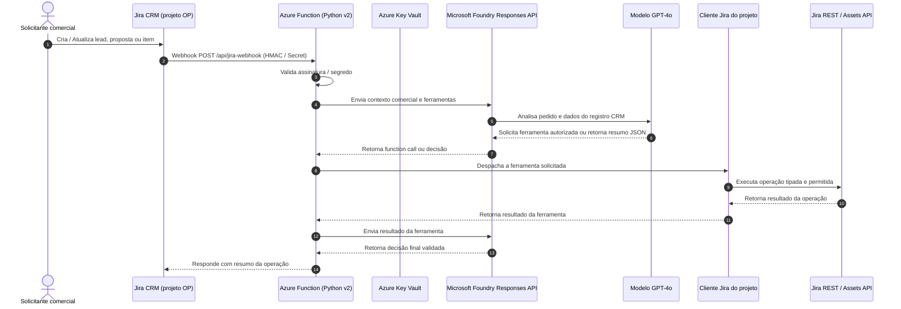

# OSB Jira Commercial CRM Agent 🤖

Agente de Inteligência Artificial que usa um modelo e a Responses API do **Microsoft Foundry** para apoiar o controle comercial no **Jira**: leads, oportunidades, propostas, itens de proposta, compras e consulta de produtos no Jira Assets. Não é um agente de triagem de incidentes de TI. O projeto mantém a Azure Function de webhook e também pode ser executado como Hosted Agent Foundry.

---

## 📌 Arquitetura da Solução

O fluxo operacional é orientado a eventos (*event-driven*), garantindo tempo de resposta quase em tempo real e eficiência de custos com computação serverless:



> **Importante:** este projeto não configura nem usa um conector Jira nativo do Foundry. O Foundry
> fornece o modelo e o function calling; as ferramentas são definidas pelo projeto, e a Azure
> Function executa as chamadas REST ao Jira por meio do cliente em `src/jira/connector.py`.
>
> O processamento do webhook é compartilhado por duas entradas: a Azure Function para receber
> diretamente os webhooks Jira e o Hosted Agent com protocolo `invocations`. O Jira deve continuar
> apontando para a Function, que verifica o segredo do webhook. O endpoint Hosted Agent é destinado
> a clientes que já possam autenticar-se no Foundry; não pressupõe que o Jira consiga autenticar-se
> diretamente nesse endpoint.

### Principais Pilares

1. **Microsoft Foundry**: Fornece o modelo pela Responses API na Azure ou por um endpoint local OpenAI-compatible do Foundry Local; a Function ou o Hosted Agent executa o ciclo de function calling.
2. **Azure Functions e Foundry Hosted Agent**: A Function recebe webhooks Jira; o serviço Hosted Agent oferece uma entrada compatível com o protocolo Invocations.
3. **Cliente Jira implementado pelo projeto**: Executa operações tipadas na API REST do Jira e Assets usando credenciais guardadas fora do código; não é um conector nativo do Foundry.
4. **Segurança Enterprise**:
   - Autenticação com serviços Azure via **Managed Identity** (`DefaultAzureCredential`).
   - Validação de webhooks com verificação em tempo constante (`hmac.compare_digest`) contra segredos protegidos.
5. **Infraestrutura como Código (Terraform)**: Módulos reutilizáveis para Azure AI Foundry, Key Vault e Function App.
6. **Tooling Moderno**: Gerenciamento ultrarrápido com `uv` e testes automatizados com `pytest`.

---

## 📁 Estrutura do Repositório

```text
osb-jira-agent/
├── .github/
│   └── workflows/
│       └── ci.yml                 # Pipeline CI (Lint, Test, Terraform check)
├── terraform/                     # Infraestrutura como Código modular
│   ├── main.tf                    # Orquestração principal dos módulos
│   ├── variables.tf               # Variáveis de entrada
│   ├── outputs.tf                 # Endpoints e IDs provisionados
│   ├── terraform.tfvars.example   # Modelo de variáveis locais
│   └── modules/
│       ├── ai_foundry/            # AI Services, Hub & Model Deployment
│       ├── key_vault/             # Key Vault e gestão de segredos
│       └── function_app/          # Storage, Function App e RBAC
├── src/
│   ├── agent/
│   │   ├── foundry_client.py      # Conexão com Foundry via DefaultAzureCredential
│   │   ├── prompts.py             # Prompt comercial e regras de negócio
│   │   └── triage_agent.py        # Orquestração de operações comerciais e function calling
│   ├── jira/
│   │   ├── connector.py           # Cliente REST Jira/Assets e execução das ferramentas
│   │   └── tools.py               # Definições e schemas das ferramentas permitidas
│   ├── models/
│   │   ├── agent_result.py        # Modelos Pydantic de saída da decisão
│   │   └── jira_webhook.py        # Modelos Pydantic de payload do Jira
│   ├── security/
│   │   └── webhook_verifier.py    # Validação de token e HMAC do webhook
│   ├── hosted_agent/
│   │   └── main.py                # Adapter do protocolo Foundry Invocations
│   ├── utils/
│   │   └── logger.py              # Logging formatado
│   ├── config.py                  # Pydantic Settings e variáveis de ambiente
│   ├── function_app.py            # Entrada HTTP da Azure Function
│   └── webhook_handler.py         # Processamento compartilhado entre as entradas
├── tests/
│   ├── conftest.py                # Fixtures e payloads de exemplo
│   ├── test_function_app.py       # Testes dos endpoints HTTP da Function
│   ├── test_hosted_agent.py       # Testes do adapter Foundry Invocations
│   ├── test_triage_agent.py       # Testes do prompt comercial e parsing de decisão
│   └── test_webhook_security.py   # Testes de validação de segurança
├── function_app.py                # Ponto de entrada raiz do Azure Functions host
├── host.json                      # Configuração do runtime do Azure Functions
├── local.settings.json.example    # Variáveis para emulação local do Azure Functions
├── pyproject.toml                 # Dependências gerenciadas via uv
├── Makefile                       # Comandos rápidos de automação
├── .env.example                   # Exemplo de variáveis de ambiente
├── azure.yaml                     # Serviço Hosted Agent para Azure Developer CLI
└── README.md                      # Documentação do projeto
```

---

## Microsoft Foundry Hosted Agent

O serviço em `azure.yaml` declara um Hosted Agent de código Python 3.13 usando o protocolo
`invocations` 2.0.0. O adapter em `src/hosted_agent/main.py` encaminha o corpo bruto e os headers
para `src/webhook_handler.py`, a mesma rotina chamada pela Function. Assim, a autenticação do
webhook, a validação do payload, o filtro de eventos e a triagem não são duplicados.

O Hosted Agent espera um projeto Foundry e um deployment de modelo já existentes; essa configuração
não cria recursos nem implanta um modelo. O runtime fornece `FOUNDRY_PROJECT_ENDPOINT`, aceito
como alias de `AZURE_AI_PROJECT_ENDPOINT`. Configure `AZURE_AI_MODEL_DEPLOYMENT_NAME` com um
deployment existente no projeto. `azure.yaml` não contém endpoint, ID ARM nem credenciais.
Antes de um deploy futuro, associe um ambiente do Azure Developer CLI ao projeto Foundry existente
e defina nele `AZURE_AI_PROJECT_ENDPOINT` e `AZURE_AI_MODEL_DEPLOYMENT_NAME`.

As credenciais Jira e o segredo do webhook são dados sensíveis: não os coloque em `azure.yaml`.
Para o Hosted Agent, forneça `JIRA_WEBHOOK_SECRET`, `JIRA_INSTANCE_URL`, `JIRA_API_EMAIL`,
`JIRA_API_TOKEN` e as demais configurações `JIRA_*` pelo mecanismo seguro de segredos/ambiente do
runtime. Mantenha `JIRA_ENABLE_WRITE_OPERATIONS=false` até confirmar os IDs de workflow e as
permissões da instância alvo.

Para depurar no VS Code, instale as dependências com `uv sync --all-extras` e escolha **Attach to
Foundry Hosted Agent**. A task associada inicia localmente o servidor Invocations com debugpy e
pode abrir o Agent Inspector. Isso é separado de `func start`; nenhum dos servidores é iniciado
durante esta preparação.

---

## 🚀 Como Executar Localmente

### 1. Pré-requisitos
- Python 3.11, 3.12 ou 3.13
- [uv](https://docs.astral.sh/uv/) instalado (`curl -LsSf https://astral.sh/uv/install.sh | sh`)
- [Azure Functions Core Tools](https://learn.microsoft.com/azure/azure-functions/functions-run-local) (`npm i -g azure-functions-core-tools@4`)
- [Azure CLI](https://learn.microsoft.com/cli/azure/install-azure-cli) (`az login`)
- Para verificar os requisitos locais, use `./scripts/check-local-prereqs.sh`. O script faz o pré-flight
  e solicita confirmação interativa antes de instalar ou atualizar componentes; use `--check-only`
  para apenas diagnosticar ou `--update` para incluir atualizações no plano. Ele instala Azurite
  somente quando `AzureWebJobsStorage` usa `UseDevelopmentStorage=true`.

### 2. Instalação das Dependências

Utilize o `uv` para sincronizar o ambiente virtual isolado:

```bash
make install
# ou diretamente:
uv sync --all-extras
```

### 3. Configuração de Ambiente

Copie os modelos de configuração e preencha com as credenciais do seu ambiente:

```bash
cp .env.example .env
cp local.settings.json.example local.settings.json
```

Variáveis chave em `.env` / `local.settings.json`:
- `MODEL_PROVIDER`: `azure` (padrão), `foundry-local` ou `ollama`.
- `AZURE_AI_PROJECT_ENDPOINT`: Endpoint completo do projeto Foundry (`https://<account>.services.ai.azure.com/api/projects/<project>`).
- `FOUNDRY_PROJECT_ENDPOINT`: alias aceito para o endpoint injetado pelo runtime Hosted Agent.
- `AZURE_AI_MODEL_DEPLOYMENT_NAME`: Nome de um modelo já implantado nesse projeto.
- `FOUNDRY_LOCAL_MODEL_ALIAS`: Alias do modelo instalado localmente (padrão `phi-4-mini`).
- `FOUNDRY_LOCAL_BASE_URL`: Endpoint OpenAI-compatible local (padrão `http://127.0.0.1:5273/v1`).
- `OLLAMA_MODEL_NAME`: Nome do modelo instalado no Ollama (padrão `qwen3:4b`).
- `OLLAMA_BASE_URL`: Endpoint OpenAI-compatible local do Ollama (padrão `http://127.0.0.1:11434/v1`).
- `JIRA_WEBHOOK_SECRET`: Token ou segredo compartilhado para validar requisições do Jira.
- `JIRA_INSTANCE_URL`: URL base da organização no Atlassian Cloud.
- `JIRA_API_EMAIL` e `JIRA_API_TOKEN`: credenciais Basic Auth para a API Jira.
- `JIRA_TEAM_ACCOUNT_IDS`: JSON opcional que associa nomes de equipe a `accountId`s do Jira, se uma atribuição for explicitamente solicitada.
- `JIRA_ALLOWED_PROJECT_KEYS`: lista JSON dos projetos que as ferramentas podem acessar.
- `JIRA_ENABLE_WRITE_OPERATIONS`: habilita explicitamente criação, comentários, transições e write-back.

O modo de escrita é **desabilitado por padrão**, mesmo quando as credenciais estão presentes.
Defina `JIRA_ENABLE_WRITE_OPERATIONS=true` apenas depois de validar o projeto e os IDs de transição
no Jira. Quando habilitado, o agente pode executar apenas as operações comerciais de escrita
explicitamente solicitadas; por padrão, prioridade, atribuição, status genérico e comentário interno
ficam sem alteração. A atribuição só é feita para equipes presentes em `JIRA_TEAM_ACCOUNT_IDS`.
As ferramentas rejeitam chaves de issue
fora de `JIRA_ALLOWED_PROJECT_KEYS` e verificam se a transição indicada está disponível antes de
executá-la. Sem credenciais Jira, o agente não consegue consultar nem alterar issues.

### Usar Foundry Local durante o desenvolvimento

O backend Azure continua sendo o padrão e preserva a Responses API. Para usar o modelo no
computador, escolha `MODEL_PROVIDER=foundry-local` em `.env` e `local.settings.json`, e informe
o alias do modelo em `FOUNDRY_LOCAL_MODEL_ALIAS`. O script prepara o SDK Foundry Local, baixa
os execution providers e o modelo se necessário, carrega-o e valida uma chamada de ferramenta
antes de informar sucesso:

```bash
./scripts/check-local-prereqs.sh --provider foundry-local
```

O script exibe as ações previstas e pede confirmação antes de sincronizar dependências ou baixar
runtime/modelos. Para somente inspecionar os pré-requisitos, use
`./scripts/check-local-prereqs.sh --provider foundry-local --check-only`. Para escolher outro
alias: `--model <alias>`. Depois da preparação, inicie a Function como de costume (`make run` ou
`func start`). O processo Python carrega o modelo e inicia o endpoint local; nenhuma chamada ao
Azure Foundry é feita neste modo.

Esse modo mantém as ferramentas do agente no código da Function. O Jira Cloud e suas APIs ainda
são serviços externos e exigem conectividade e credenciais; apenas o modelo é executado no
computador. Para usar Azurite, mantenha `AzureWebJobsStorage=UseDevelopmentStorage=true`; ele
emula o armazenamento Azure exigido pelo host local e não tem relação com o modelo. Com outra
configuração de armazenamento, Azurite não é necessário.

### Usar Ollama durante o desenvolvimento

O Ollama é uma alternativa local que não usa o SDK nativo Foundry Local. Instale o Ollama pelo
[site oficial](https://ollama.com/download), inicie seu serviço e configure `.env` para usar
`MODEL_PROVIDER=ollama`, `OLLAMA_MODEL_NAME=qwen3:4b` e
`OLLAMA_BASE_URL=http://127.0.0.1:11434/v1`. Qwen3:4b é a opção inicial recomendada para testar
tool calling; a disponibilidade de memória e a velocidade dependem da quantização e do hardware
local.

Para baixar o modelo e testar function calling sem iniciar a Function:

```bash
./scripts/check-local-prereqs.sh --provider ollama
```

O script pede confirmação antes de baixar o modelo e valida a chamada de ferramenta no endpoint
local. Para apenas conferir o estado, use `--check-only`. O Jira continua sendo acessado pela
rede e exige credenciais; apenas as inferências do modelo ficam locais.

Depois que o modelo passar na verificação, use `make run-ollama` para iniciar a Azure Function
com o backend local. Esse alvo define as variáveis Ollama para o processo sem alterar seu `.env`
ou sobrescrever credenciais locais; para usar outro modelo, defina `OLLAMA_MODEL_NAME` antes do
comando.

### Ferramentas correspondentes aos manifestos

As 18 operações dos manifestos estão expostas como function tools nomeadas e com argumentos
validados. O agente não recebe acesso a URLs, métodos HTTP nem payloads Jira arbitrários:

| Área | Ferramentas |
|---|---|
| Leads | `create_lead`, `get_lead_details`, `start_lead_work`, `transition_lead_to_proposal_item`, `generate_new_proposal` |
| Issues e itens da proposta | `get_issue_fields`, `find_proposal_items`, `get_proposal_item_values`, `send_item_to_purchasing`, `set_proposal_item_price` |
| Comentários e anexos | `add_internal_comment`, `list_issue_attachments`, `download_issue_attachment` |
| Assets | `get_assets_cloud_id`, `get_assets_workspaces`, `list_assets_schemas`, `get_assets_object_types`, `search_assets_products_by_manufacturer` |

`JIRA_TRANSITION_IDS` permite substituir os IDs de workflow dos manifestos. Os IDs fornecidos são
específicos da instância original; confirme-os no workflow de destino. O download de anexos só
permite anexos pertencentes à issue indicada e tem limite configurável em
`JIRA_ATTACHMENT_MAX_BYTES` (64 KiB por padrão). Notas adicionadas pela ferramenta são sempre
internas. A pesquisa AQL usa `JIRA_ASSETS_PRODUCT_OBJECT_TYPE_ID` (157 por padrão).

Para chamadas Jira Assets, configure `JIRA_ASSETS_CLOUD_ID` e `JIRA_ASSETS_WORKSPACE_ID` para
evitar descoberta automática. Se houver um único workspace, o conector pode descobri-lo. A API
Assets usa `JIRA_ASSETS_ACCESS_TOKEN` como Bearer quando fornecido; caso contrário, usa o API token
Jira configurado, somente contra o host Atlassian fixo `api.atlassian.com`.

O recurso Terraform atual cria a conta AI Services e o deployment do modelo, mas não cria um
projeto Foundry. Crie/seleciona o projeto no Foundry e informe seu endpoint exato em
`azure_ai_project_endpoint` no Terraform ou `AZURE_AI_PROJECT_ENDPOINT` localmente. A antiga
`AZURE_AI_PROJECT_CONNECTION_STRING` é aceita apenas como fallback de compatibilidade; prefira o
endpoint explícito do projeto. Para o Hosted Agent, `FOUNDRY_PROJECT_ENDPOINT` também é aceito
como alias pelo runtime.

Crie um API token Atlassian para uma conta de agente com as permissões necessárias para consultar e editar
issues, adicionar notas internas e executar transições no Jira. Localmente,
guarde o token apenas no `.env` ou `local.settings.json` (ambos ignorados pelo Git). No Terraform,
informe `jira_api_email` e `jira_api_token`; o token será armazenado no Key Vault e referenciado
pela Function App. Embora o Terraform marque o token como sensível, ele também pode constar no
state; use backend de state protegido e nunca versione state ou `terraform.tfvars`. Configure
account IDs, por exemplo:

```json
{"Cloud-Platform": "account-id-do-jira", "ServiceDesk-L1": "outro-account-id"}
```

### 4. Execução dos Testes Automatizados

Execute a suíte de testes unitários com `pytest`:

```bash
make test
# ou:
uv run pytest --verbose
```

### 5. Iniciar a Function App Localmente

Para iniciar o runtime de emulação do Azure Functions:

```bash
make run
# ou:
func start
```

O endpoint estará acessível em:
```text
http://localhost:7071/api/jira-webhook
```

---

## 🔐 Configuração do Webhook no Jira

1. No Jira, acesse **Configurações (Jira Settings)** > **Sistema (System)** > **Webhooks** (`/plugins/servlet/webhooks`).
2. Clique em **Create a Webhook**.
3. **URL**: `https://<sua-function-app>.azurewebsites.net/api/jira-webhook`
4. Em **Headers**, adicione:
   - Header Name: `X-Atlassian-Webhook-Secret`
   - Value: `<valor-do-JIRA_WEBHOOK_SECRET>`
5. Em **Events**, marque:
   - **Issue**: `created` e `updated`.
   - JQL recomendado: `project = "OP"` (para restringir aos registros comerciais deste fluxo).
6. Salve o webhook.

---

## 🏗️ Provisionamento com Terraform

Para criar os recursos na Azure (Resource Group, AI Foundry, Key Vault, Storage e Function App com Managed Identity):

```bash
cd terraform
cp terraform.tfvars.example terraform.tfvars
# Edite as variáveis conforme desejado em terraform.tfvars

terraform init
terraform plan
terraform apply
```

O Terraform configurará automaticamente as atribuições de RBAC:
- **Cognitive Services OpenAI User** para a Managed Identity da Function App no serviço do Foundry.
- **Key Vault Secrets User** para a Function App acessar segredos com segurança.

---

## 📦 CI/CD com GitHub Actions

O repositório inclui uma pipeline pronta em `.github/workflows/ci.yml`:
- **Lint e Formatação**: `ruff check` e `ruff format --check`.
- **Testes Unitários**: `pytest` com relatório detalhado.
- **Validação de Infraestrutura**: `terraform fmt -check` e `terraform validate`.

---

## 📄 Licença

Este projeto é desenvolvido para uso interno de integração entre Microsoft Foundry e Jira CRM/Assets.

## Foundry Toolkit Agent Inspector

O Hosted Agent (`src/hosted_agent/main.py`) é um servidor HTTP. O `agent-dev-cli`
está no grupo `dev` do `pyproject.toml` (`uv sync`). No VS Code, use F5 com
"Attach to Foundry Hosted Agent": a task sobe `agentdev run` na porta 8088 com
debugpy na 5679, e o Inspector abre pelo Foundry Toolkit.
